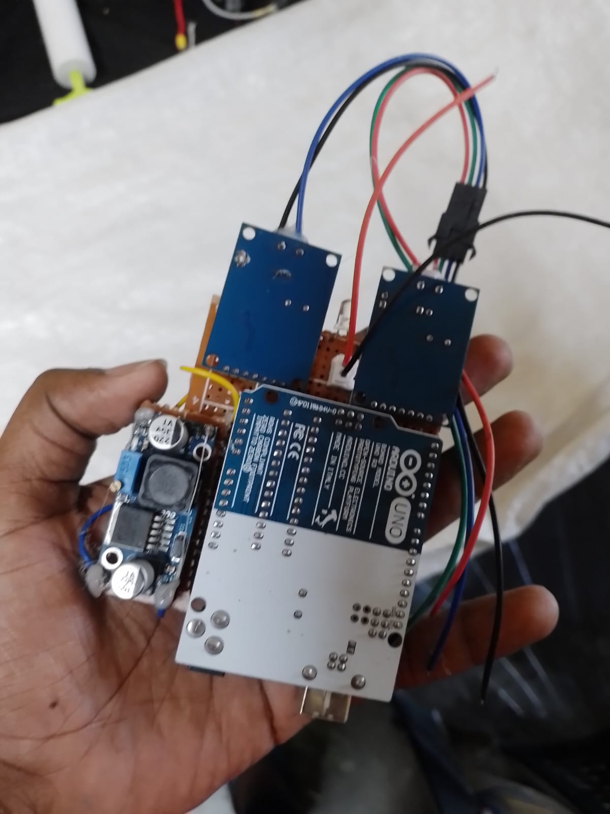
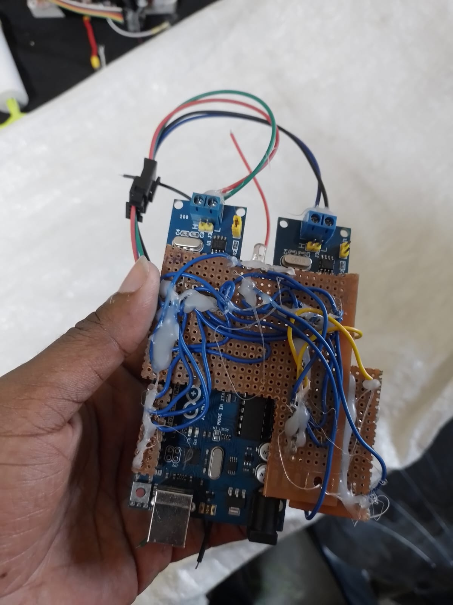
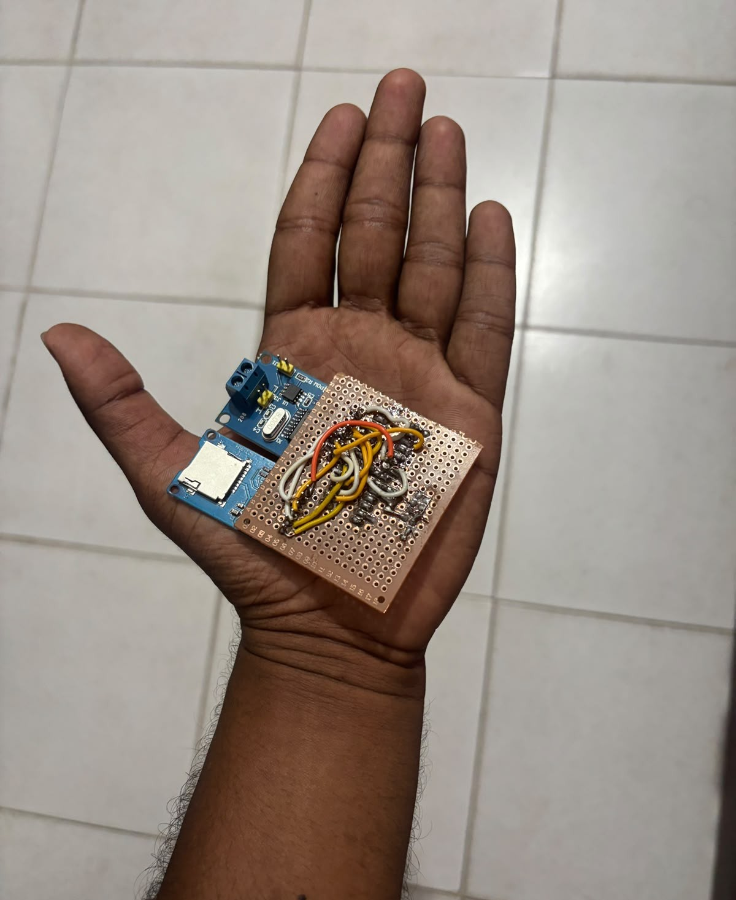

# CAN Bus Development

This project captures my work building and refining an Arduino-based CAN bus system around the MCP2515 controller. It started as a data logger, grew into a filtered CAN interface, and later moved to a standalone ATmega328P setup programmed with Arduino as ISP.

## Circuit Gallery

<table>
  <tr>
    <td align="center"><br />Initial Circuit</td>
    <td align="center"><br />Initial Circuit</td>
  </tr>
  <tr>
    <td align="center"><br />Final Circuit</td>
    <td align="center"><br />Final Circuit</td>
  </tr>
</table>

## Overview

The project followed a clear development path:

- I first built a CAN logger to receive and store bus traffic through an MCP2515 module.
- I then extended that setup with CAN filtering where can data was transfered only from one can line to the next.
- Finally, I moved the logger design onto a standalone ATmega328P and programmed it using an Arduino as ISP.

Each stage built on the previous one and helped me move from basic communication testing to a more complete embedded hardware workflow.

## What the Logger Does

The logger reads incoming CAN frames, captures a timestamp, and writes the message data to a CSV file on an SD card. The implementation also includes status handling through serial output and an LED indicator so the hardware state is easy to monitor during testing.

## Development Flow

CAN Logger  
↓  
CAN Filter Device 
↓  
Arduino as ISP Programming  
↓  
Standalone ATmega328P CAN Logger

## Highlights

- MCP2515 CAN controller integration over SPI
- CSV logging of CAN ID, DLC, and data bytes
- CAN acceptance filtering and mask configuration
- Arduino as ISP programming for standalone ATmega328P deployment
- Serial debugging and hardware bring-up

## Repository Layout

```text
CanLogger/
├── CanFilter/
├── logger/
├── img/
└── README.md
```
